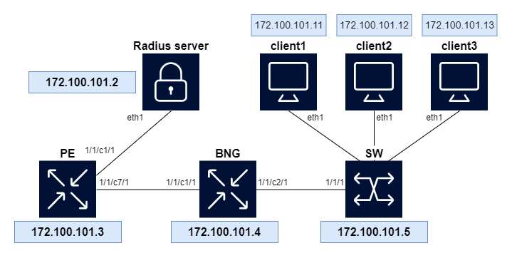

# Using Python to customize BNG subscriber flow

In this lab, we demonstrate the use of Python to introduce complex business login in the BNG subscriber flow. The use-case is as follows:

In our network, there are 3 BNG clients that want to obtain an IP address:
- client 1 (Office01) is identified by its MAC address (`00:00:00:01:01:01`)
- client 2 (Office02) is identified by its MAC address (`00:00:00:02:02:02`)
- client 3 (Office03) is identified by its hostname (`server.office3`)

**Grading: intermediate**

## Drawing



## Deploying the lab

desciption
```
sudo containerlab deploy -t sros-bng.clab.yml
```

**It can take up to 5 minutes for the lab to fully start**

## Tools needed  

Visual Studio Code: to edit the two python files (you don't run these files!)

## Tool explanation

When you clone this repository, you will find two python files which you should use to complete the lab. In the comments, you can find hints on what steps you should execute to complete the lab. Note that although you may change configuration on any of the nodes in this lab setup, this is not required! The lab can be completed by modifying only the two files below:
- `dhcp-script.py`
- `radius-script.py`

these files are automatically mounted through tftp. Be careful to always reload your python files on the BNG node after you have made changes to the scripts. To reload the python files, login to the BNG node and execute the two commands below:

```
/ tools perform python-script reload "dhcp-script.py"
/ tools perform python-script reload "radius-script.py"
```

To view the output of your script, subscribe to log 66, which is pre-configured to show output of the two scripts:

```
[/]
A:admin@BNG# /tools perform log subscribe-to log-id 66

[/]
A:admin@BNG#
```

## Credentials section

To access the devices, ssh to the IP or host-name with the credentials in the table below

| Hostname                   | IP             | Username | Password |
|----------------------------|----------------|----------|----------|
| clab-hackathon-bng-bng     | 172.100.101.3  | admin    | admin    |
| clab-hackathon-bng-pe      | 172.100.101.4  | admin    | admin    |
| clab-hackathon-bng-sw      | 172.100.101.5  | admin    | admin    |
| clab-hackathon-bng-client1 | 172.100.101.11 | root     | alpine   |
| clab-hackathon-bng-client2 | 172.100.101.12 | root     | alpine   |
| clab-hackathon-bng-client3 | 172.100.101.13 | root     | alpine   |

Example: 

```
ssh admin@clab-hackathon-bng-bng
```

## Tasks

* **task1**
    familiarize yourself with the BNG setup and the currently active subscribers by logging in to the BNG node. Some commands that might come in helpful throughout this lab are shown below
    ```
    / show service id 5050 ipoe session all
    / clear service id 5050 ipoe session all
    / show service active-subscribers
    / show service id 5050 dhcp lease-state
    ```

    Additionally, log into the three clients and observe their DHCPv4 configuration (in the file `/etc/network/interfaces`). Note that currently none of the clients are able to obtain an IP address.

    ```
    client1:/etc/network# ifdown eth1; sleep 1; ifup eth1;
    client1:/etc/network# udhcpc: started, v1.34.1
    udhcpc: broadcasting discover
    udhcpc: broadcasting select for 10.24.1.112, server 10.24.1.5
    udhcpc: broadcasting select for 10.24.1.112, server 10.24.1.5
    udhcpc: broadcasting select for 10.24.1.112, server 10.24.1.5
    udhcpc failed to get a DHCP lease
    udhcpc: no lease, forking to background
    ```
 
* **task2**
    As you will see, the DHCP client configuration of all clients includes hex-encoded client-id (`0ff1ce0[X]`), where `X` is the client ID. Your task consists of writing a pySROS script that will copy the client ID into the circuit-id field so that it may be used to identify the subscriber. This will cause clients 1 & 2 to be able to successfully obtain an IP address on interface `eth1.100`.

    For this exercise, it is only necessary to fill out `exercise_1()` of the `dhcp-script.py`. Note that both files need to be on the BNG node. Upon successful completion of this first exercise, you will see the output below:

    ```
    (pr)[/configure python python-policy "test"]
    A:admin@BNG# / show service id 5050 subscriber-hosts

    ===============================================================================
    Subscriber Host table
    ===============================================================================
    Sap
    IP Address
        MAC Address                PPPoE-SID       Origin          Fwding State
        Subscriber
    -------------------------------------------------------------------------------
    [1/1/c2/1:100]
    10.24.1.112
        00:00:00:01:01:01          N/A             DHCP            Fwding
        0ff1ce01
    [1/1/c2/1:100]
    10.24.1.113
        00:00:00:02:02:02          N/A             DHCP            Fwding
        0ff1ce02
    -------------------------------------------------------------------------------
    Number of subscriber hosts : 2
    ===============================================================================
    ```

    Resources you might find helpful:
    - [SR BNG Python3 ALC DHCPv4 documentation](https://documentation.nokia.com/sr/23-3-1/tpsda-python-3-api/alc-dhcpv4.html)

    <br>
* **task3**
    Client 3 is still not able to subscribe to the BNG, because the radius server uses the hostname for authentication, instead of the MAC address used for the first two clients:

    #### `AAA_CFG/mods-config/files/authorize`
    ```
    00:00:00:01:01:01                       Cleartext-Password  := "comlab-bng-customer"
                                            Framed-IP-Address = 10.24.1.112,
                                            ...

    00:00:00:02:02:02                       Cleartext-Password  := "comlab-bng-customer"
                                            Framed-IP-Address = 10.24.1.113,
                                            ...

    server.office3                          Cleartext-Password  := "comlab-bng-customer"
                                            Framed-IP-Address = 10.24.1.114,
                                            ...
    ```

    The correct DHCP "Client FQDN" (option 81) field has already been added to the DHCP configuration of client 3. Fill out `exercise_2()` in `dhcp-script.py` and `radius-script`.py to complete this exercise.

    Resources you might find helpful:
    - [SR BNG Python3 ALC Radius documentation](https://documentation.nokia.com/sr/23-3-1/tpsda-python-3-api/alc-radius.html)
    - [SR BNG Python3 ALC cache documentation](https://documentation.nokia.com/sr/23-3-1/tpsda-python-3-api/alc-cache.html)
    
    <br>

    **NOTE: some clarifications to the ALC cache library**
    - `alc.cache.set(key, value)` is deprecated and can no longer be used, use `alc.cache.save(value, key)` instead
    - `alc.cache.get(key)` is deprecated and can no longer be used, use `alc.cache.retrieve(key)` instead
    - `alc.cache.save(value, key)`: syntax is `value, key`, not `key, value`!

