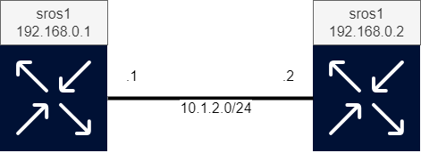

# SR OS Stateful Show Commands

Inside this lab you will use pySROS to generate a customized view of the routing table. Your script should output a view of the Base router's routing table with a timestamp and a number indicating how many times your script has been run. The routing table view should contain rows where each row has the prefix, the protocol through which the route is learned and the IP address of the next-hop node, if applicable.

**Grading: Beginner**

**Elements: SR OS, pySROS, CRON, File I/O**

## Drawing



## High level tasks to complete this project

1. Connect to either sros1 or sros2 and observe how the custom CLI command is configured, rename it or make your own if desired.
2. Write a program that gets the routes from the routing-table and outputs them in a table.
3. Amend the program to add timestamps to the output
4. Add File I/O to the script such that the output is written to the router's file system.
5. Finally add the sequence number to the flow such that each additional run has a new sequence number in its output.

## Deploying the lab

From the labs directory enter the following command to run the lab.

```
sudo containerlab deploy
```

This can take around 5 minutes to completely bring up all SROS devices with associated routing.
*Note: It is always advisable to do all development in a non-`root` user.  `containerlab` requires `root` to run though so use `sudo` as in the example above for the `deploy` and `destroy` arguments*

## Tools needed  

| Role | Software |
| --- | --- |
| Router | SR OS release 23.3.R1 |

## Tool explanation

All tasks for the lab use-case can be completed on the provided nodes. The goal of this lab is to solve some tasks by writing code. Through container binds the nodes need only be made aware of the changes via the provided `tools` command.

## Credentials and access

* sros1:            Default SR OS username and password
* sros2:            Default SR OS username and password

If you wish to have direct external access from your machine, use the public IP address of the VM and the external port numbers as per the table below:

| Node          | Software |  Direct SSH (Ext.)      | NETCONF (Ext.) |
| -----         | ---------| ---------------------- | -------------- |
| sros1         |  SR OS release 23.3.R1 |`ssh admin@IP:41001`   | `IP:41401`     |
| sros2         |  SR OS release 23.3.R1 |`ssh admin@IP:41002`   | `IP:41402`     |

sros-stateful-show.rc and sros-stateful-show.remote.rc are included in the lab. The former can be used on the hackathon VM when working there, the latter can be used on your local machine to access the network after populating the public IP address of the VM. Simply source the desired file to load the aliases.

## Reference documentation

* [pySROS documentation](https://network.developer.nokia.com/static/sr/learn/pysros/latest)
* [pySROS repo](https://github.com/nokia/pysros)
* [SR OS documentation](https://documentation.nokia.com/sr/)

## Tasks

* **Connect to either sros1 or sros2 and observe how the custom CLI command is configured, rename it or make your own if desired.**
Configuration for custom commands is contained in `/configure system management-interface cli md-cli environment command-alias`.

* **Write a program that gets the routes from the routing-table and outputs them in a table.**
Modify the file `sros_stateful_route_table.py` in the scripts folder, it is linked to each node in the topology. The nodes can be triggered to re-read the contents via the command `/tools perform python-script reload "sros_stateful_route_table"`. Your changes are then read into the running version of the script.

* **Amend the program to add timestamps to the output**
Take a look at pySROS' documentation, specifically the libraries adapted for SR OS as they include some options when it comes to timing.

* **Add File I/O to the script such that the output is written to the router's file system.**
Store your script's outputs in the the sros_stateful folder on cf3:/. To accomplish this, again refer to the pySROS libraries as they include I/O. Some potentially useful commands to see the output your script is producing:

    ```
    /file
    change-directory sros_stateful
    list
    show <filename>
    ```

* **Finally, add the sequence number to the flow such that each additional run has a new sequence number in its output.**

*Enhancement: The configuration to run this script as a CRON task is included in the lab configuration though it is disabled by default. To enable it, add following configuration:*
    ```
    configure {
        system {
            cron {
                schedule "sros_stateful_route_table" owner "admin" {
                    admin-state enable
                }
            }
        }
    }
    ```
*CRON output is configured to be stored in `cf3:/sros_stateful/`. Does your script behave as intended when executed through CRON?*
*Enhancement: Can you make your script run from your local machine? This entails connecting to the routers with pySROS from a remote location instead of locally. Does the script behave the same in this scenario?*
