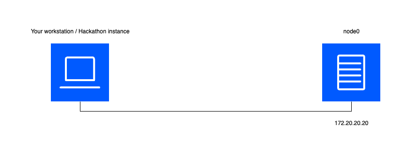

# SR OS enhanced login banner with pySROS

Addressing this use-case will empower you to adjust your SR OS system to provide the
information that you require each time you connect to the device in MD-CLI.

**Grading: Beginner**

**Elements: SR OS, pySROS**

## Drawing

devices needed (hostname, type, ...)



## High level tasks to complete this project

1. Identify some data that should be displayed on login to SR OS using the MD-CLI pwc and info commands to navigate around the YANG-modelled data
2. Write a Python 3 application using the pySROS libraries that extracts this data and prints it out
3. Create a login-script that calls your Python application on login to display the chosen data

## Deploying the lab

From the labs directory enter the following command to run the lab.

```
sudo containerlab deploy
```

*Note: It is always advisable to do all development in a non-`root` user.  `containerlab` requires `root` to run though so use `sudo` as in the example above for the `deploy` and `destroy` arguments*

## Tools needed  

| Role | Software |
| --- | --- |
| Router | SR OS release 23.3.R1 |


## Tool explanation

All tasks for the lab use-case can be completed on the provided SR OS node.  Python code may be developed and tested remotely and uploaded to the node in order to complete the lab if that is preferable.

## Credentials and access

* node0: Default SR OS username and password

If you wish to have direct external access from your machine, use the public IP address of the VM and the external port numbers as per the table below:

| Node  | Direct SSH (Ext.)      | NETCONF (Ext.) | 
| ----- | ---------------------- | -------------- | 
| node0 | `ssh admin@IP:58000`   | `IP:58400`     |


## Reference documentation

* [pySROS API documentation](https://network.developer.nokia.com/static/sr/learn/pysros/latest)
* [SR OS documentation](https://documentation.nokia.com/sr/)


## Tasks

* **Identify some data that should be displayed on login to SR OS using the MD-CLI pwc and info commands to navigate around the YANG-modelled data**

    Explore the MD-CLI using the `info` and `pwc` commands for both configuration and state data in order to choose a selection of data points that you will find beneficial to see at login.

    *Enhancement: If you wish to go a step further you can create a new data metric that you would like to display using a mathematical formula given another existing data point.*
 
* **Write a Python 3 application using the pySROS libraries that extracts this data and prints it out**
    
    Create a simple Python application using the pySROS libraries to obtain the identified data and print it to the screen.  This may be done on the device using the `file edit` command to edit to file on the device itself or on your local machine or the lab server.  Once you are happy with the application you can copy it to the router and run it locally (take a look at the `pyexec` command).

    An example pySROS application is shown [here](./elb.py) to get you started.

    To test your code remotely ensure your `Connection` object has all the required parameters and just run it.  Communication with the node will be handled by pySROS.

* **Create a login-script that calls your Python application on login to display the chosen data**

    * Copy your `elb.py` pySROS application to `cf3:`
    * Create a login script file called `login.scr` in `cf3:` that
      runs `pyexec cf3:\elb.py`
    * Configure `node0` to call the login-script for all users on login

